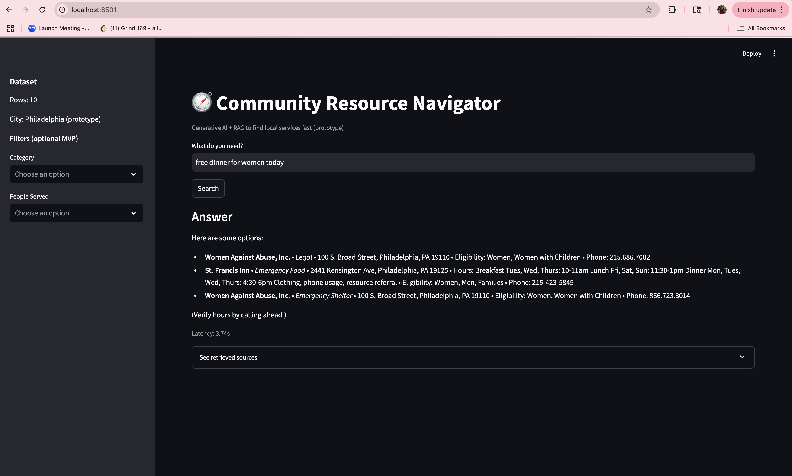
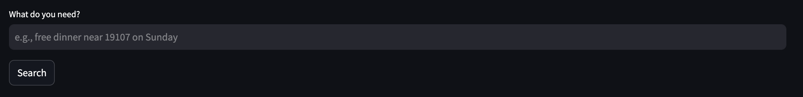
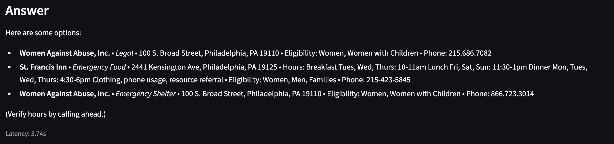
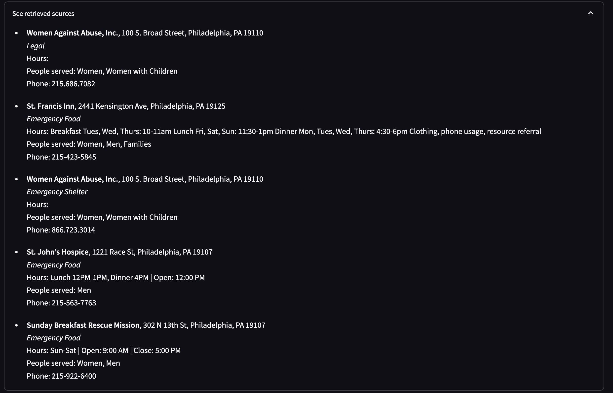

# 🧭 Community Resource Navigator – Design Specification

## 1️⃣ Overview  
The **Community Resource Navigator** is a lightweight Generative AI + RAG (Retrieval-Augmented Generation) prototype that helps residents in Philadelphia find essential community resources such as food pantries, shelters, free clinics, and legal aid.  
Users can ask questions in plain English — for example, “Where can I get free dinner near 19107 on Sunday evening?” — and the system retrieves the most relevant services from a structured dataset of local organizations.

---

## 2️⃣ User Journeys  

### **Journey 1: Finding Immediate Help**  
**Goal:** A user needs an urgent service (e.g., food or shelter).  
**Steps:**  
1. Open the Streamlit web app.  
2. Type a question like “I need emergency shelter for women with children.”  
3. (Optional) Apply filters — *Category = Emergency Shelter*, *People Served = Women with Children*.  
4. Click **Search**.  
5. The app displays concise cards listing service name, address, hours, eligibility, and phone.  
6. The user can expand **See retrieved sources** for full records.  

**Outcome:** Quickly find accurate, structured information without navigating multiple websites.

---

### **Journey 2: Case Worker or Volunteer Query**  
**Goal:** A volunteer wants to check which centers serve meals after 5 PM.  
**Steps:**  
1. Open the app and enter “free dinner after 5 PM near 19107.”  
2. Filter → Category: Emergency Food.  
3. Review top 5 recommendations with hours and contact numbers.  
4. Copy or share results directly.  

**Outcome:** Saves time and reduces manual searching for recurring client needs.

---

### **Journey 3: Planning Support for a Family**  
**Goal:** A user plans a day’s support — needs both a meal and hygiene services.  
**Steps:**  
1. Ask: “Where can I get dinner + showers tonight in Philadelphia?”  
2. System retrieves relevant centers mentioning both *food* and *showers*.  
3. User reads the summary and calls the most suitable center.  

**Outcome:** Multiple needs addressed through one conversational query.

---

## 3️⃣ Task Flow  

[User Query]
↓
[Pre-Filters Applied] → Category, People Served
↓
[Hybrid Retrieval]
• BM25 keyword search
• SentenceTransformer embeddings
• Fused scores
↓
[Top-K Results → Offline Answer]
↓
[Display Cards + Expandable Sources]

markdown
Copy code

**Optional Future Flow:** Add *LLM Summarizer* → Refine Answer Tone → Streamlit Display.

---

## 4️⃣ Key Screens & Interactions  

### 🏠 **Home / Search Screen**
- **Header:** “Community Resource Navigator 🧭”  
- **Search Bar:** text input (“What do you need?”)  
- **Filters Sidebar:**   
  - Category (multi-select)  
  - People Served (multi-select)  
  - Future: Zip code, Time of day  
- **Search Button** triggers retrieval pipeline  

### 📋 **Results Section**
Arch Street United Methodist Church • Emergency Food •
55 N Broad St • Hours: Sunday 5–7 PM • Eligibility: Women, Men, Families • Phone: 215-568-6250

yaml
Copy code
Footer note: “Verify hours by calling ahead.”

### 📚 **Expand View**
*See Retrieved Sources* → raw records for transparency and debugging.  

### 🧠 **Future Prototype Screen**
Conversational chat UI with streaming answers, context grounded in retrieved rows, and optional feedback buttons.

---

## 5️⃣ Tools and Technologies  

| Layer | Tools / Libraries |  
|:--|:--|  
| **Backend Logic** | Python (Streamlit) |  
| **Search Engine** | rank_bm25 + sentence-transformers MiniLM |  
| **Data Store** | CSV (`services.csv`) |  
| **Frontend** | Streamlit web UI |  
| **LLM Option** | OpenAI GPT-4 / Mistral-7B (optional RAG phase) |  
| **Version Control** | Git + GitHub |  

---

## 6️⃣ Prototype (Screenshots)

### 🖥️ **Full Prototype on Web**

### 🔍 **Search Interface**

### 🧾 **Generated Service Cards**

### 📚 **Expandable Sources Panel**

---

## 7️⃣ Validation Plan (Checkpoint 2)

- Conduct prompt-based validation using three tools:  
  - ChatGPT  
  - Microsoft Copilot  
  - Perplexity AI  
- Compare answers for accuracy, specificity, and reliability.  
- Store transcripts under `/validation/`.  
- Perform **Gap Analysis** → identify failures (accuracy, reliability, latency, UX).  
- Define **Opportunity Framing** → what our Navigator improves (speed, grounding, clarity, zero cost).  

---

## 8️⃣ Risks & Mitigation  

| Risk | Description | Mitigation |  
|:--|:--|:--|  
| **Data Staleness** | Outdated addresses/hours | Use official city feeds for refresh |  
| **Limited Coverage** | Philadelphia only | Mark as pilot scope → multi-city phase later |  
| **LLM Hallucination** | Possible if LLM used without grounding | Keep RAG strictly CSV-based |  
| **Usability Gaps** | Filters might confuse first-time users | Add example queries and onboarding tip card |  

---

## 9️⃣ Future Enhancements  
- Day/time filtering (e.g., “open after 5 PM”)  
- Radius search (using lat/lon)  
- Multilingual interface (Spanish, Mandarin)  
- Grounded LLM summaries  
- Feedback loop for continuous improvement  
- Analytics dashboard for usage insights  

---

*Maintained by:* **Satviki Sharma** 📧 satviki2@illinois.edu  